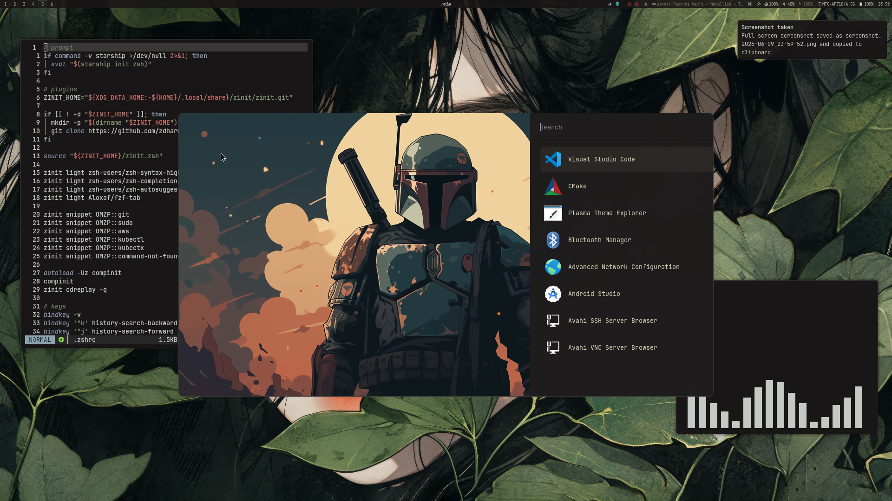

# Mono



## Install

```bash
git clone https://github.com/box1o/mono.git
cd mono
./setup.sh --all
```

## Update Existing Install

```bash
cd mono
git pull
./setup.sh --all --replace
```

## Useful Commands

```bash
./setup.sh --packages
./setup.sh --configs --replace
./setup.sh --scripts --replace
./setup.sh --postinstall
```

## Hotkeys

| Key | Action |
| --- | --- |
| `Alt Shift A` | Open launcher |
| `Alt Shift D` | Open terminal |
| `Alt Shift S` | Open browser |
| `Alt Shift F` | Open files |
| `Alt Shift C` | Close focused window |
| `Alt Q` | Lock session |
| `Alt Shift Q` | Open power menu |
| `Super M` | Open session menu |
| `Super R` | Restart Waybar |
| `Super Shift O` | Restart desktop portals |
| `Super Shift W` | Pick wallpaper |
| `Super Shift T` | Toggle theme |
| `Super N` | Toggle scratchpad workspace |
| `Super Shift N` | Move window to scratchpad |
| `Print` | Full screenshot |
| `Super P` | Region screenshot |
| `Super Shift S` | Active window screenshot |
| `Super Shift E` | Region screenshot with editor when `swappy` is installed |
